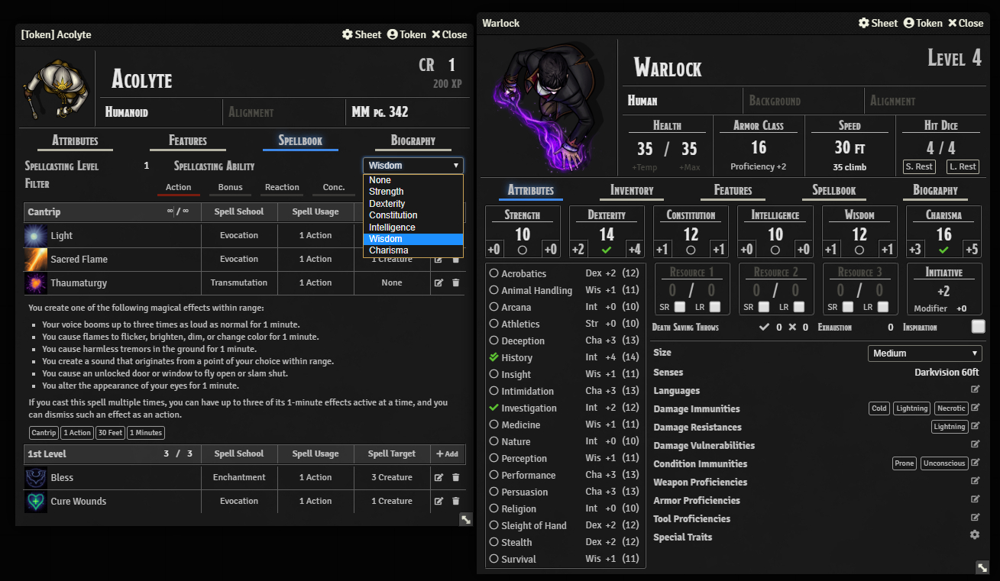

# D&D5E Dark Mode - Foundry VTT

- A dark sheet style for the default D&D5E Character,NPC and Item sheets and also for [BetterNPCSheets5e](https://github.com/syl3r86/BetterNPCSheet5e) by Felix.

Tested on Foundry v0.6

This module overwrites the styling (CSS) of the official 5e sheet that comes with dnd5e system for foundry and also BetterNPCSheets5e
* All the same functionality, just different color scheme.

You can select the Dark sheet per Actor.

### Whetstone Compatible

If Whestone is active, the Foundry-Wide Dark Mode setting will be dropped in favor of allowing Whetstone to manage the theme's activation. Darkmode Character sheets can be selected even without activating the Whetstone theme.

## Changelog:

Update v2.2.5
* Improved compatibility with SRD+, including rudimentary styling for the Charactermancer

Update v2.2.4
* Fixed Dark Mode sheets failing to switch some text styles

Update v2.2.3
* Fixed various elements having transparent backgrounds

Update v2.2.2
* Improved compatibility with D&D System 1.2.2
* Fixed missing backgrounds in SRD+

Update v2.2.1
* Improved compatibility with D&D System 1.2.0
* Improved compatibility with Token Health

Update v2.2.0
* Integrates with Whetstone optionally
______________

Update v2.1.2
* Fixed Compatibility issues with Foundry 0.7.5
* Fixed Compatibility issues with D&D System 0.98.0
* Improved compatibility with:
  - Beyond20 Companion
  - Token Tooltip Alt
  - SRD+
______________

Update v2.0.5
* Fixed Compatibility issues with D&D System 0.93
* Added Support for "Token Bar" Module
______________

Update v2.0.3
* Fixed Compatibility issues with Foundry 0.5.7
* Fixed Compatibility issues with D&D System 0.90
* Fixed macro text visibility for The Furnace
* Fixed VTTA - Party overview with VTTA - Beyond Integration
______________
v2.0.2
- minor fixes (search bar in compendiums, description in rolltables)
- fixed some issues for "DNDBeyond Character Sheet for 5e by ChalkOne" with Dark Mode Active

______________
v2.0.0
- changed white for a slightly less bright one to reduce eyestrain
- checkboxes are now inverted to fit better
- Added **FOUNDRY WIDE DARK MODE** - activate in the module settings with a tickbox
    - Changes the color scheme of everything in Foundry to "Dark Mode"

 Tested with these mods, should turn them into Dark Mode as well:

               - About Time
               - Sky's Alternate 5e Sheet
               - Better Filepicker
               - Better Rolls for 5e
               - Calendar/Weather
               - Combat Utility Belt
               - Dice Calculator
               - Dynamic Effects
               - The Furnace
               - GM Notes
               - Item Delete Check
               - Loot Sheet NPC 5e
               - Magic Items
               - SRD+
               - Point of Interest Character Sheet
               - Polygot
               - Token Mold
               - VTTA - Party Overview

I tried my best to check everywhere and covert everything but I probably missed couple of things, so If you discover any issues or inconsistencies, please let me know! Thank you! ^^

_______________
v1.0.6
- Small update to fix "Creature Size Select" colors
________________
v1.0.5
- Small update for D&D5E System Release v0.83 - fixed colors of (un)prepared/(un)equipped icons
________________
v1.0.2
- Added support for BetterNPCSheets by Felix
- You can now choose between Default and Dark Mode sheet per Actor and Item

## Known Issues:
- None at the moment
_________________
## Installation
1. Copy this link and use it in Foundrys Module Manager to install the Module

    > https://raw.githubusercontent.com/Stryxin/dnd5edark-foundryvtt/master/module.json

2. Enable the Module in your Worlds Module Settings

If you have any suggestions please contact me on discord - Stryxin#7572

## License
 Better NPC Sheet - a module for Foundry VTT - by <a xmlns:cc="http://creativecommons.org/ns#" href="https://github.com/syl3r86?tab=repositories" property="cc:attributionName" rel="cc:attributionURL">Felix Müller</a> is licensed under a <a rel="license" href="http://creativecommons.org/licenses/by/4.0/">Creative Commons Attribution 4.0 International License</a>.

This work is licensed under Foundry Virtual Tabletop [EULA - Limited License Agreement for module development v 0.1.6](http://foundryvtt.com/pages/license.html).
